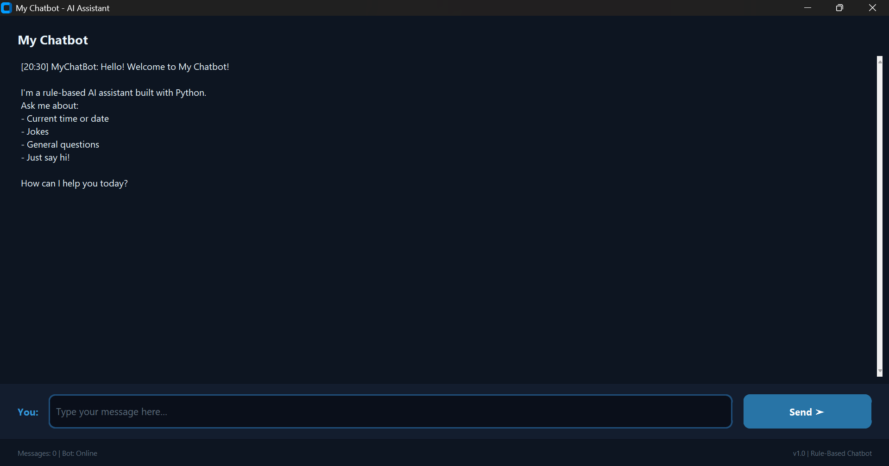
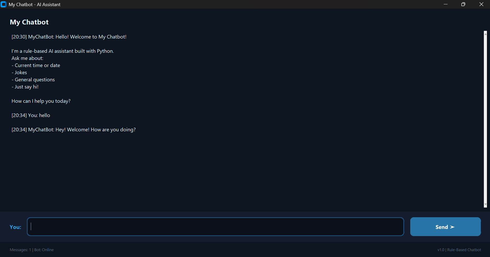
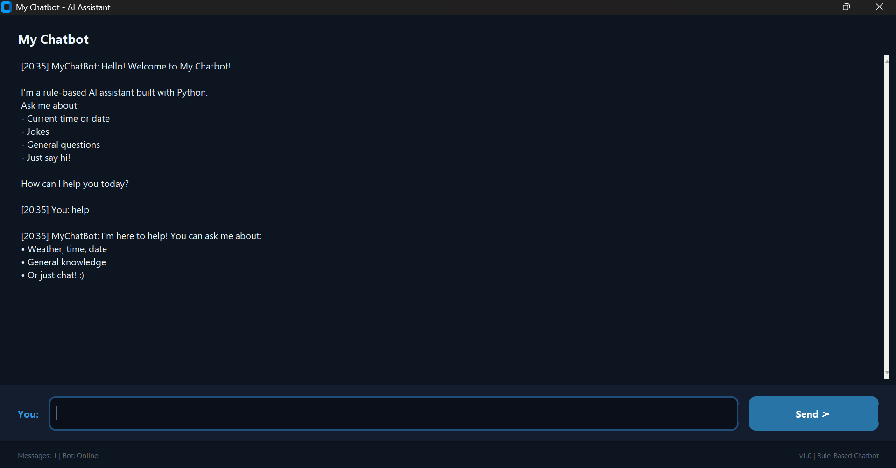

# Rule-Based Chatbot


A simple chatbot built using Python and CustomTkinter.


## Features


- Modern GUI using CustomTkinter

- Greetings and farewell responses

- Date and time queries

- Joke responses

- Message timestamps

- Auto-scrolling chat area


## Screenshots

### Welcome Screen


### Chat Example


### Help Command



## Technologies Used


- Python

- Tkinter

- CustomTkinter


## Installation


```bash

pip install -r requirements.txt

python main.py

```


## Future Improvements


- AI-powered responses

- Chat history saving

- Better intent recognition


## Author


Abhishek

